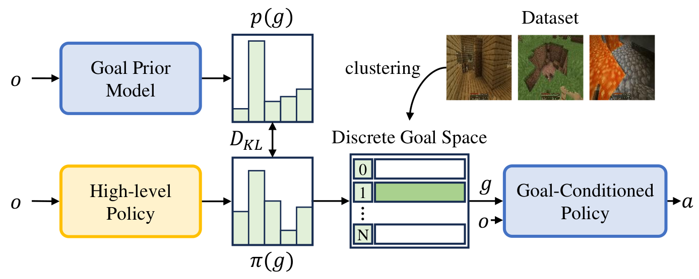

# Pre-Training Goal-based Models for Sample-Efficient Reinforcement Learning
<div align="center">

[[Paper]](https://openreview.net/forum?id=o2IEmeLL9r)
[[Website]](https://sites.google.com/view/ptgm-iclr) 



</div>

PTGM is a novel task-agnostic pre-training method that pre-trains goal-based models to accelerate downstream RL. PTGM involves pre-training a low-level, goal-conditioned policy and training a high-level policy to generate goals for subsequent RL tasks. To address the challenges posed by the high-dimensional goal space, while simultaneously maintaining the agent's capability to accomplish various skills, we propose clustering goals in the dataset to form a discrete high-level action space. Additionally, a goal prior model is pre-trained to regularize the behavior of the high-level policy in RL, enhancing sample efficiency and learning stability. 

## Installation

- Create a conda environment with `python==3.9.12`. Install packages with `pip install -r requirements.txt`.

- Install the [MineDojo](https://github.com/MineDojo/MineDojo) environment and [MineCLIP](https://github.com/MineDojo/MineCLIP) following their official documents.

- Upgrade the MineDojo package:
  - `pip uninstall minedojo`.
  - Install the [upgraded MineDojo](https://github.com/PKU-RL/MCEnv).
 

- Download pre-trained models for MineCraft: run `bash downloads.sh` to download the MineCLIP model and the VPT-2x model.


## Folders
VPT: VPT official code. Model and policy for VPT.

sb3_vpt: VPT-adapter model, policy and replay buffer in stable_baseline3

steve1: agent modification and other functions for Steve-1

tasks: MineDojo wrappers for RL

downloads: download models and datasets

hierarchical: a high-level controller outputs img-goal embeddings for Steve-1

goal_prior: cluster codebook for high-level controller; train a goal prior


## Download and pre-process the dataset
```
python steve1/data/generation/convert_from_contractor.py \
--batch_size 32 \
--num_episodes -1 \
--worker_id 0 \
--output_dir downloads/dataset_contractor/ \
--index  8.x \
--min_timesteps 1 \
--start_idx 0
```
Set `--index` to 8.x, 9.x, 10.x respectively to download the three subsets of the contractor dataset. 

Split training and validation set:
```
python steve1/data/sampling/generate_sampling.py \
--output_dir downloads/samplings \
--val_frames 10_000 \
--train_frames 30_000_000
```
If you do not download the whole dataset, set `--train_frames` to the actual number of frames for training.

Cluster the MineCLIP embeddings of observations to acquire a discrete high-level action space:
```
python goal_prior/generate_codebook.py \
--embedding tsne \
--n-codebook 100
```

## Pre-training goal-based models 
- Train the goal-conditioned policy: run `bash steve1/train_goal_conditioned_policy.sh`.

- Train the goal prior model: run `bash goal_prior/train_goal_prior.sh`.

Or download the pre-trained models and goal clusters [here](https://disk.pku.edu.cn/link/AAFD7852E16FFB43E09FB2BD34E7B41E7B).


## Train high-level policies for downstream tasks with PPO

Train for "harvest log on plains" as an example:
```
python ppo_highlevel.py \
--config log_plains \
--name ppo_highlevel_log \
--discrete \
--goal_prior \
--kl_reward 0.05 \
--low_level_steps 100 \
--steps_per_iter 40 \
--steps 15000 \
--in_weights $PATH_TO_YOUR_GOAL_CONDITIONED_POLICY.weights \
--prior_weights $PATH_TO_YOUR_GOAL_PRIOR_MODEL.weights \
--codebook $PATH_TO_YOUR_GOAL_CLUSTERS.pkl 
```

`--config` specifies the task. All tasks in the paper are `log_plains, water_bucket, cobblestone, iron_ore, spider`. Task configurations are in `tasks/task_specs.yaml`.


## Citation
```bibtex
@inproceedings{anonymous2024pretraining,
    title={Pre-Training Goal-based Models for Sample-Efficient Reinforcement Learning},
    author={Anonymous},
    booktitle={The Twelfth International Conference on Learning Representations},
    year={2024},
    url={https://openreview.net/forum?id=o2IEmeLL9r}
}
```
